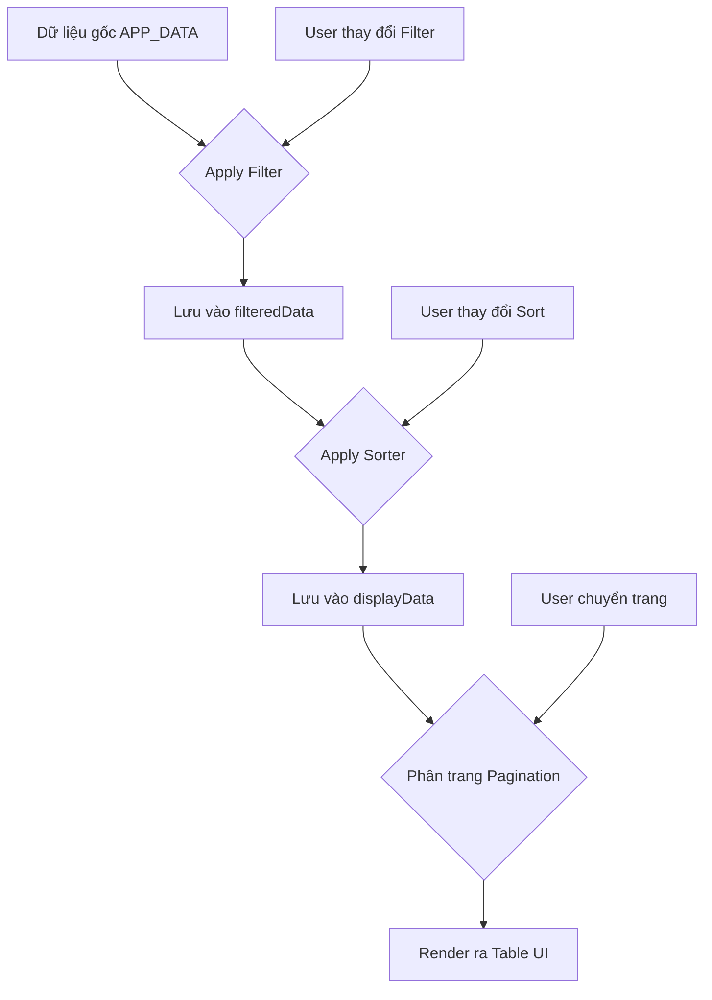

# Kế hoạch Tái cấu trúc Filter & Sorter - 9Trip ERP

## 1. Phân tích hiện trạng (Current Issues)

- **Conflict trạng thái:** Filter và Sorter đang ghi đè trực tiếp vào `PG_DATA` mà không lưu giữ trạng thái của nhau. Khi Sort, nó lấy `PG_DATA` hiện tại (có thể đã bị filter) nhưng nếu Filter lại, nó lại lấy từ `APP_DATA` gốc và làm mất kết quả Sort trước đó.
- **Pagination conflict:** Khi chuyển trang, Pagination chỉ render dựa trên `PG_DATA`. Nếu `PG_DATA` bị thay đổi không đồng bộ, số trang và dữ liệu hiển thị sẽ sai lệch.
- **Secondary Index (Grouped Data):** Việc xử lý dữ liệu nhóm (như `booking_details_by_booking`) đang được code riêng lẻ, dẫn đến logic Filter/Sort không đồng nhất với bảng phẳng (Flat table).
- **Hiệu suất:** Việc đọc lại toàn bộ `APP_DATA` mỗi lần Filter có thể gây lag nếu dữ liệu lớn.

## 2. Giải pháp đề xuất: Centralized Data Manager (CDM)

Thay vì dùng các biến rời rạc, ta sẽ sử dụng một Object quản lý trạng thái tập trung cho mỗi bảng.

### Cấu trúc State mới:

```javascript
var GRID_STATE = {
  currentTable: '', // Table key hiện tại
  sourceData: [], // Dữ liệu gốc (Snapshot từ APP_DATA)
  filteredData: [], // Dữ liệu sau khi Filter
  displayData: [], // Dữ liệu sau khi Sort (Dùng để Render/Paginate)

  filter: {
    // Lưu các tiêu chí filter hiện tại
    keyword: '',
    column: '',
    dateFrom: '',
    dateTo: '',
  },

  sort: {
    // Lưu trạng thái sort hiện tại
    column: '',
    dir: 'desc',
  },

  pagination: {
    // Trạng thái phân trang
    currentPage: 1,
    limit: 50,
  },
};
```

## 3. Quy trình thực thi mới (Workflow)

Mọi thay đổi (Filter, Sort, Page Change) đều phải đi qua một pipeline duy nhất:
`Source Data` -> `Filter` -> `Sort` -> `Paginate` -> `Render`.



## 4. Chi tiết các bước thực hiện (Action Plan)

### Bước 1: Khởi tạo GRID_STATE và Pipeline

- Thay thế `PG_DATA`, `SORT_STATE`, `PG_STATE` bằng một đối tượng `GRID_STATE` duy nhất.
- Viết hàm `refreshGridPipeline()` để thực hiện chuỗi: Filter -> Sort -> Render.

### Bước 2: Tái cấu trúc `applyGridFilter`

- Không ghi đè `PG_DATA` ngay lập tức.
- Cập nhật `GRID_STATE.filter`.
- Gọi `refreshGridPipeline()`.
- Hỗ trợ lọc đa điều kiện (Keyword + Date Range) một cách minh bạch.

### Bước 3: Tái cấu trúc `applyGridSorter`

- Cập nhật `GRID_STATE.sort`.
- Thực hiện Sort trên `GRID_STATE.filteredData` (để giữ kết quả filter).
- Lưu kết quả vào `GRID_STATE.displayData`.
- Gọi `renderCurrentPage()`.

### Bước 4: Đồng bộ Secondary Index

- Tích hợp logic `isSecondaryIndex` vào pipeline.
- Nếu là bảng nhóm: Sau khi Filter/Sort, thực hiện Grouping dữ liệu trước khi Render.

### Bước 5: Tối ưu UI/UX

- Cập nhật icon Sort, trạng thái Filter trên UI để người dùng biết đang áp dụng những gì.
- Đảm bảo nút "Reset" xóa sạch `GRID_STATE` về mặc định.

## 5. Lợi ích

- **Tính nhất quán:** Filter và Sort hoạt động "chồng" lên nhau một cách chính xác.
- **Dễ bảo trì:** Logic tập trung tại một pipeline, dễ debug khi có lỗi dữ liệu.
- **Mở rộng:** Dễ dàng thêm các tính năng như lọc theo nhiều cột cùng lúc hoặc lưu cấu hình bộ lọc của người dùng.
